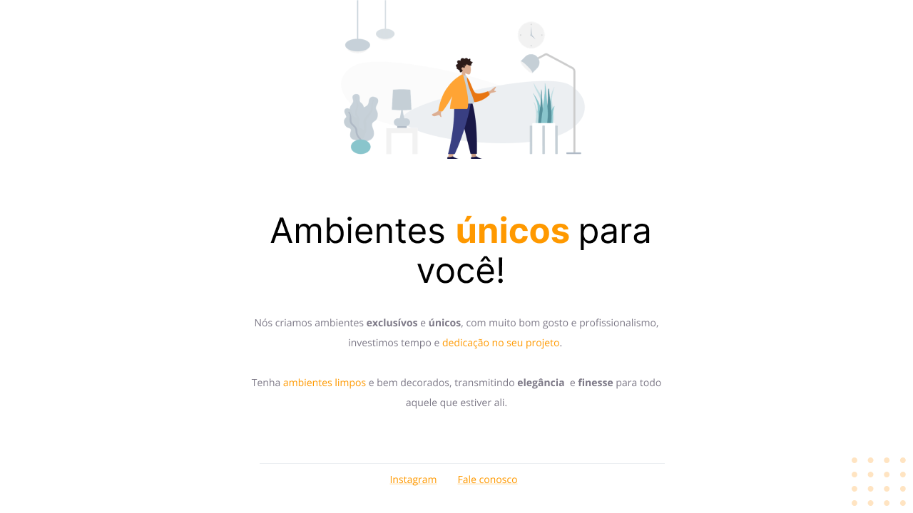

<h1 align="center">Desafio - Replicar template</h1>

  

## 🚀 Tecnologias

Esse projeto foi desenvolvido com as seguintes tecnologias:

- HTML e CSS
- Git e Github
- Figma
 
## ✏️ Layout

🔗 Link-Figma: https://www.figma.com/file/wvi78P8Tvt5E3N7zUbNSDX/Explorer---Projeto-01-(Copy)?node-id=0%3A1&t=YJmS4cDLg0BPKYVX-1

---

🌌 By Lucas Loopst
