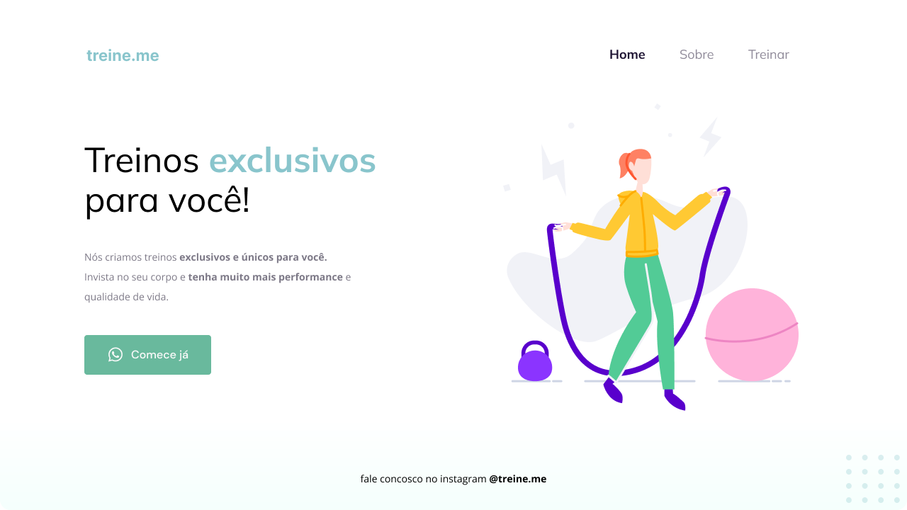

<h1 align="center">Desafio - Corrigir Semântica e Acessibilidade do código</h1>

  

## 🚀 Tecnologias

Esse projeto foi desenvolvido com as seguintes tecnologias:

- HTML e CSS
- Git e Github
- Figma
 
## 📌 Nota

O arquivo antes da minha correção está zipado e anexado neste repositório.
 
## ✏️ Layout

🔗 Link-Figma: https://www.figma.com/file/2FwdFImDdel3bIKw1UbtrN/Explorer---Projeto-02-(Copy)?node-id=0%3A1&t=v9KETPs4XBoWVRal-1

---

🌌 By Lucas Loopst
