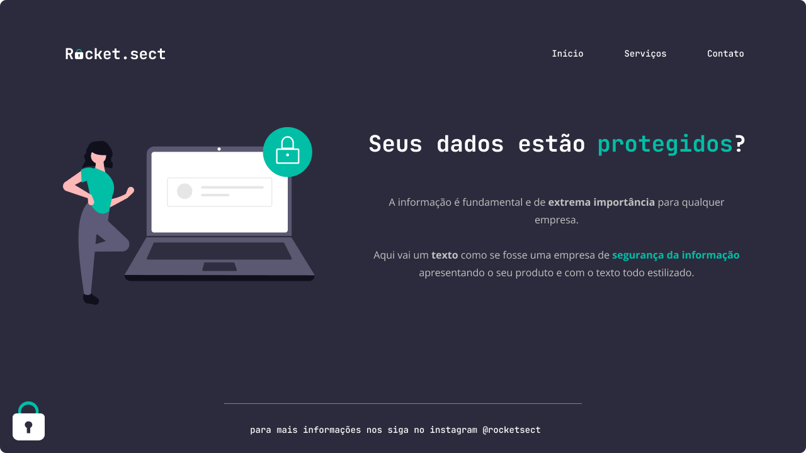

<h1 align="center">Desafio - Replicar template</h1>

  

## 🚀 Tecnologias

Esse projeto foi desenvolvido com as seguintes tecnologias:

- HTML e CSS
- Git e Github
- Figma
 
## ✏️ Layout

🔗 Link-Figma: https://www.figma.com/file/YDdvlJc7W5IVQrnODcdTrN/Explorer-(Copy)?node-id=16-106&t=v9KETPs4XBoWVRal-0

---

🌌 By Lucas Loopst
