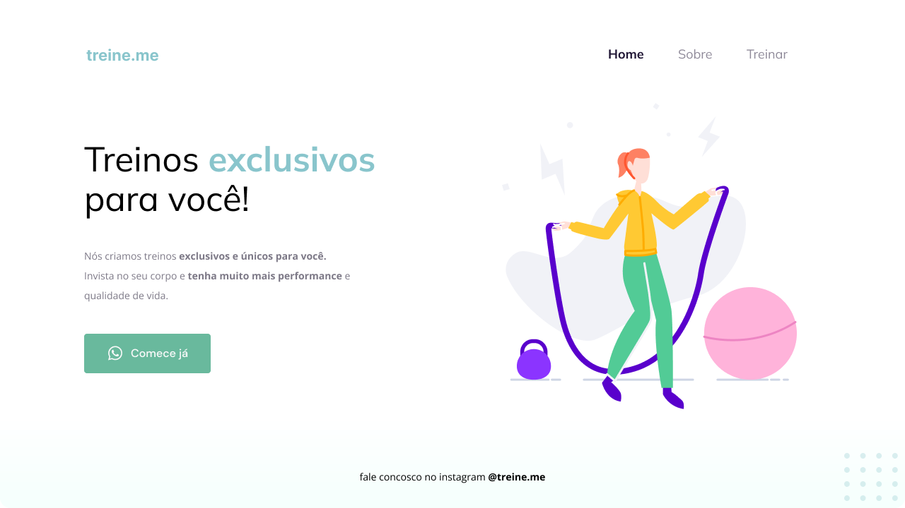

<h1>Desafio de replicar template do figma</h1>

  

## 🚀 Tecnologias

Esse projeto foi desenvolvido com as seguintes tecnologias:

- HTML e CSS
- Git e Github
- Figma

## 🔖 Layout

Link-Figma: https://www.figma.com/file/2FwdFImDdel3bIKw1UbtrN/Explorer---Projeto-02-(Copy)?node-id=0-1&t=S7cNbPqjMJWtQWWV-0
