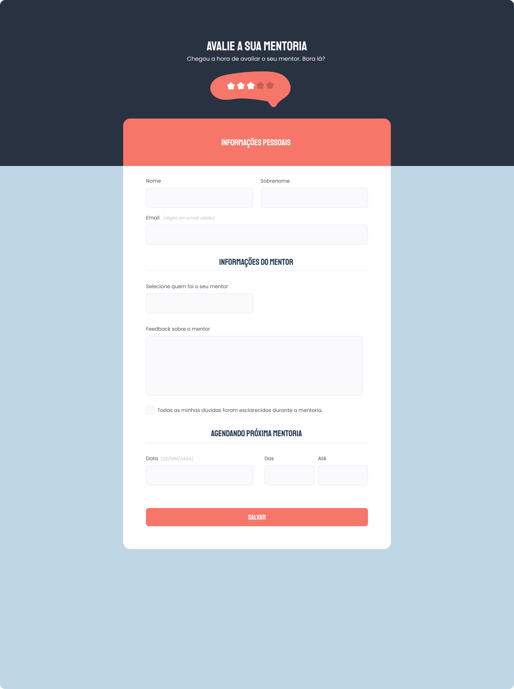

<h1 align="center">Desafio - Replicar template</h1>

  

## 🚀 Tecnologias

Esse projeto foi desenvolvido com as seguintes tecnologias:

- HTML e CSS
- Git e Github
- Figma
 
## ✏️ Layout

🔗 Link-Figma: https://www.figma.com/file/fjtSjm0JHTBpoUJnffH0Cb/Stage-03---Formul%C3%A1rio-avan%C3%A7ado-(Copy)?type=design&node-id=0%3A1&t=oNbyaIqluRWC0PNJ-1

---

🌌 By Lucas Loopst
