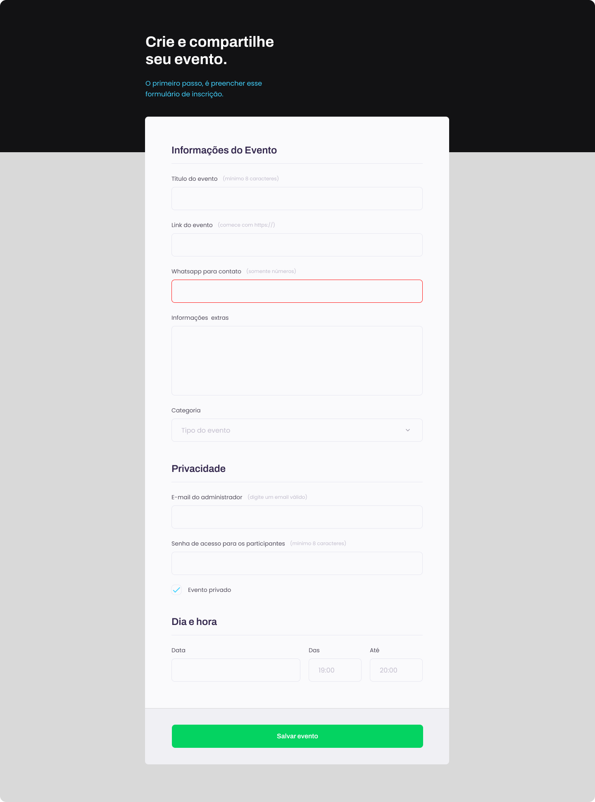

<h1 align="center">Desafio - X</h1>

  

## 🚀 Tecnologias

Esse projeto foi desenvolvido com as seguintes tecnologias:

- HTML e CSS
- Git e Github
- Figma
 
## ✏️ Layout

🔗 Link-Figma: https://www.figma.com/file/QEXFudpCUjWlz2c6M4COLL/Explorer-Stage-03-Projeto-01-(Copy)?t=xu0GG4GY8zSfD9og-1

---

🌌 By Lucas Loopst
