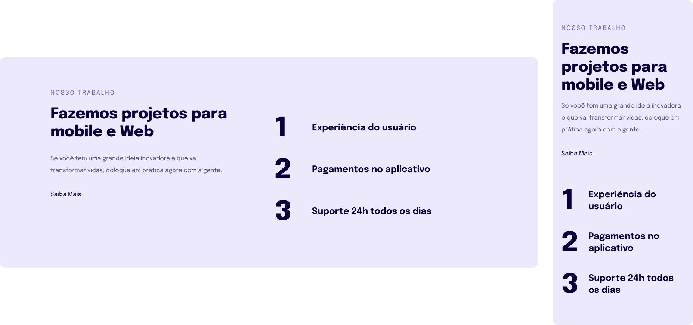

<h1 align="center">Desafio - Replicar template</h1>

  

## 🚀 Tecnologias

Esse projeto foi desenvolvido com as seguintes tecnologias:

- HTML e CSS
- Git e Github
- Figma
 
## ✏️ Layout

🔗 Link-Figma: https://www.figma.com/file/Xn1BFevhAYUUusnpsb7qku/Explorer-Stage-03-Projeto-02-(Copy)?type=design&node-id=203%3A412&t=gIYZDZ9qxT3FdniK-1
---

🌌 By Lucas Loopst
