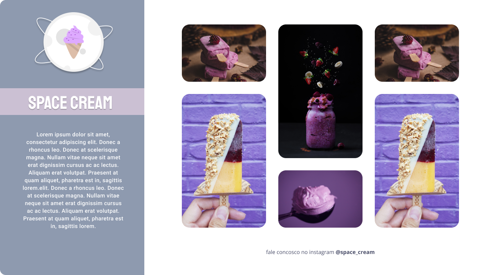

<h1 align="center">Desafio - Desktop & Animation</h1>

  

## 🚀 Tecnologias

Esse projeto foi desenvolvido com as seguintes tecnologias:

- HTML e CSS
- Git e Github
- Figma

## ✏️ Layout

🔗 Link-Figma: https://www.figma.com/file/ZA0WCrYFjMohNJ4WR5Gxn0/Stage-03---Grid-com-anima%C3%A7%C3%B5es-(Copy)?type=design&node-id=0%3A1&t=lNXQROXwiUTSYKHU-1

---

🌌 By Lucas Loopst
