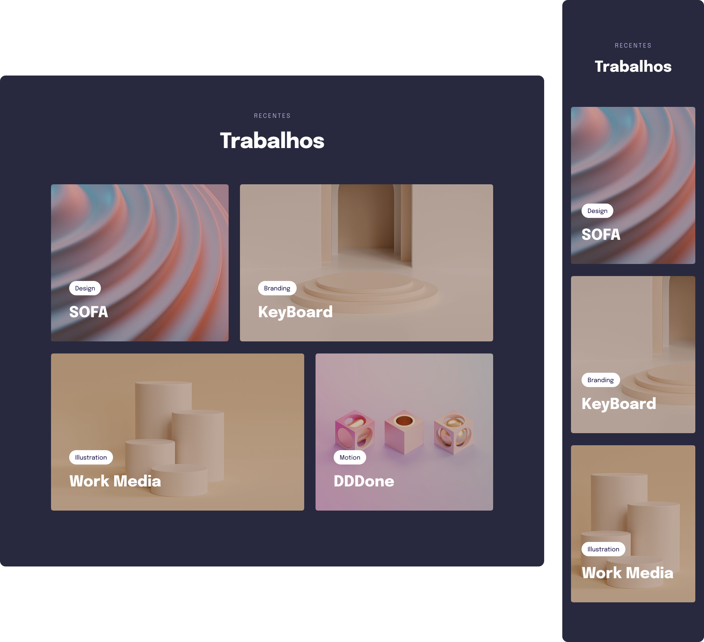

<h1 align="center">Desafio - Grid e Responsividade</h1>

  

## 🚀 Tecnologias

Esse projeto foi desenvolvido com as seguintes tecnologias:

- HTML e CSS
- Git e Github
- Figma

## ✏️ Layout

🔗 Link-Figma: https://www.figma.com/file/JPwZANuiVyBBbeVdmIId4S/Explorer-Stage-03-Projeto-03-(Copy)?type=design&node-id=203%3A1865&t=BfgJ0B9JqdJZZb9e-1

---

🌌 By Lucas Loopst
