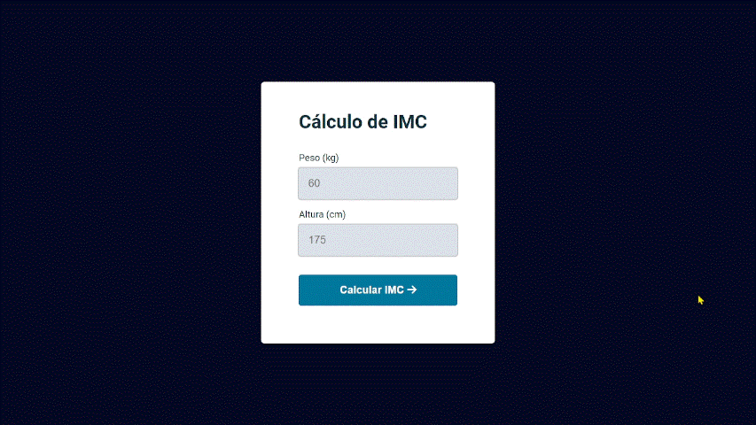

<h1 align="center">Calculadora de IMC</h1>

  

## 🚀 Tecnologias

Esse projeto foi desenvolvido com as seguintes tecnologias:

- HTML e CSS
- Javascript
- Git e Github
- Figma
  
## 📌 Nota

Para o Javascript funcionar é necessário usar a extensão "live server" do VS Code.

## ✏️ Layout

🔗 Link-Figma: https://www.figma.com/file/fGtZGNNreZzcvH44aHPaT9/IMC-(Copy)?type=design&node-id=6%3A4&mode=design&t=kXftiMlWnxyEaWOr-1

---

🌌 By Lucas Loopst
