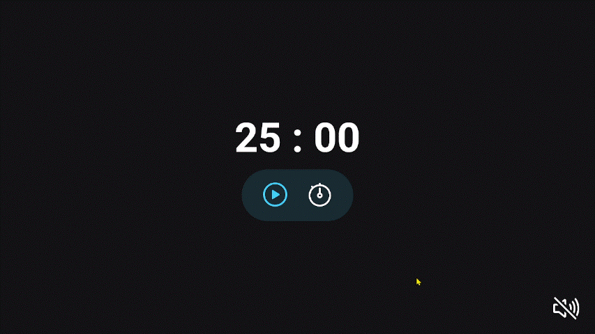

<h1 align="center">Focus timer - Pomodoro</h1>

  

## 🚀 Tecnologias

Esse projeto foi desenvolvido com as seguintes tecnologias:

- HTML e CSS
- Javascript
- Git e Github
- Figma

## 📌 Nota

Para o Javascript funcionar é necessário usar a extensão "live server" do VS Code.

## ✏️ Layout

🔗 Link-Figma: 

---

🌌 By Lucas Loopst